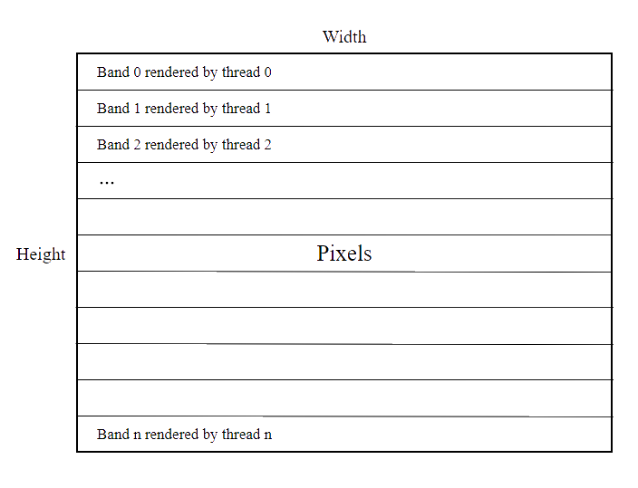

+++
title = "Raytracer wasm support"
date = 2020-11-18
[extra]
summary = "Making a toy rust ray tracer work on a browser."
+++

Lately, i got interested in ray tracing and i owe that to all the posts i see
everyday on [Hacker News](https://news.ycombinator.com) about how easy 
to build a simple ray tracer from scratch. So to get a better understanding 
of the subject, i hacked a [toy version](https://github.com/KiKoS0/ray-tracer) 
in a couple days. 

It was nothing fancy just a camera and a spheres populated 
environment but i implemented it in rust so it was a great opportunity to make it 
run in a browser. I also decided to write it about since the process wasn't as 
straightforward as i initially thought.

## Concurrency

Concurrency is achieved by simply dividing the image into sections and let each
processor handle the pixels assigned to it. 



This is done using [Rayon](https://github.com/rayon-rs/rayon)
with code as simple as this:

``` rust
    let bands: Vec<(usize, &mut [Color<u8>])> =
        pixels.chunks_mut(image_width).enumerate().collect();
    bands.into_par_iter().for_each(|(index, band)| {
        render(band, (image_width,1), index, data, world);
    });
```

Normally Rayon will spawn N system threads (typically N equals the number of logical cores)
in a ThreadPool to use, but in a browser environment you don't have the luxury of accessing low level 
APIs such as pthreads or Windows Threads. Instead browsers support parallelism via Web Workers which are
objects that runs a named JavaScript file in the background and communicates through a messaging system
(no shared memory between them).

Combining Web Workers with 
[SharedArrayBuffer](https://developer.mozilla.org/en-US/docs/Web/JavaScript/Reference/Global_Objects/SharedArrayBuffer)
allows WebAssembly threads to share mutable data that leads to a threaded environment much similar
to native platforms.

Thanks to Alex Crichton [module](https://github.com/rustwasm/wasm-bindgen/blob/master/examples/raytrace-parallel/src/pool.rs),
i didn't have to deal with creating the Web Workers from rust myself and it made executing rayon
as simple as feeding his web worker pool implementation to the rayon pool builder. 

``` rust
    let thread_pool = rayon::ThreadPoolBuilder::new()
        .num_threads(workers_num)
        .spawn_handler(|thread| Ok(pool.run(|| thread.run()).unwrap()))
        .build()
        .unwrap();
```

## Random Number Generation

I heavily used the [rand](https://github.com/rust-random/rand) crate for RNG and while
it supports wasm by enabling the ```stdweb``` feature in your ```cargo.toml```, it didn't
work as expected in a multi-threaded environment. The rand crate uses the 
[getrandom](https://github.com/rust-random/getrandom) crate internally which obviously 
is responsible of retrieving random data. getrandom had a function with this signature:
``` rust
    fn get_random_values(me: &BrowserCrypto, buf: &mut [u8]) -> Result<(), JsValue>
``` 
The ```buf```  parameter is the output buffer and apparently the ```&mut [u8]``` type did not act well
with the browser's SharedArrayBuffer, well since it's supposed to be shared between threads.
So it had to be changed to a memory region allocated by Javascript instead, it got finally fixed by this 
[PR](https://github.com/rust-random/getrandom/pull/165) later. 

Fortunately, compiling the rand crate with the master branch of getrandom didn't break anything
and nothing more than the ```cargo.toml``` file needed to change ([Fork](https://github.com/KiKoS0/rand)).

## Building the project

Rust standard library needs to be recompiled with these flags
```RUSTFLAGS='-C target-feature=+atomics,+bulk-memory'``` to ship with precompiled threading support enabled and it's also 
recommended to run cargo with the [```std```  Aware Cargo](https://github.com/rust-lang/wg-cargo-std-aware) feature to build the the standard library with these custom settings:
``` bash
    RUSTFLAGS='-C target-feature=+atomics,+bulk-memory' cargo build --target wasm32-unknown-unknown --release -Z build-std=panic_abort,std
```
And finally running ```wasm-bindgen``` with the ```--target no-modules``` flag is mandatory to run code
with multi-threading.

``` bash
    wasm-bindgen wasm_client.wasm --target no-modules
```

You could also run the compiled wasm file through  ```wasm-opt```
to optimize even more (for size or speed):

``` bash
    wasm-opt wasm_client_bg.wasm -o wasm_client_bg.wasm -O3 --enable-mutable-globals --detect-features
```
